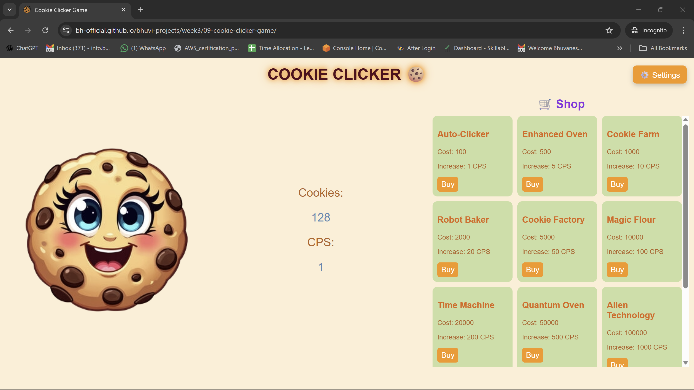

# 🍪 Cookie Clicker Game

A fully interactive incremental / idle game built using **HTML, CSS, and JavaScript**.  
The player clicks the cookie to earn cookies, buys upgrades from a dynamic shop to increase CPS (Cookies Per Second), and customizes the game using a settings menu. The game automatically saves progress and restores it when the page is reloaded.

This project was built as part of a JavaScript assignment to practice **real-world JavaScript concepts** such as DOM manipulation, event handling, fetching data from APIs, timers, and local storage.

---

## 🚀 Live Demo

🔗 Live site:  
https://bh-official.github.io/bhuvi-projects/week3/09-cookie-clicker-game/

🔗 GitHub repository:  
https://github.com/bh-official/bhuvi-projects/tree/main/week3/09-cookie-clicker-game

---

## 🎮 How the Game Works

- Clicking the main 🍪 cookie increases the cookie count.
- Every second, cookies automatically increase based on **CPS (Cookies Per Second)** using `setInterval`.
- The shop is loaded dynamically from an external API.
- Each upgrade increases CPS and costs cookies.
- When the player buys an upgrade:
  - Cookies are deducted
  - CPS is increased
  - A floating animation appears
  - A sound plays (if enabled)
- The game progress (cookies, CPS, settings) is saved in **Local Storage** and restored on reload.
- A ⚙️ Settings menu allows:
  - Enabling/disabling sound
  - Toggling dark mode

---

## ✨ Features

- Clickable cookie with animation
- Automatic cookie generation using `setInterval`
- Dynamic shop built from API data
- Upgrade purchasing system
- Floating text animations
- Sound effects
- Dark mode
- Settings menu
- Local storage save system
- Error handling using `try/catch`
- Responsive layout using Flexbox & Grid

---

## 🛠️ Technologies Used

- HTML  
- CSS (Flexbox, Grid, Animations, Dark Mode)  
- JavaScript  
- DOM Manipulation  
- Event Listeners  
- Fetch API  
- Async / Await  
- Local Storage  
- setInterval  
- try / catch error handling  
- getBoundingClientRect for animation positioning  
- Dynamic element creation using `document.createElement()` 

---

## 📦 API Used

Upgrade data is fetched from: https://cookie-upgrade-api.vercel.app/api/upgrades

---

The shop UI is generated dynamically from the API response.

---

## 🧠 Code Structure & Design

- The game state is stored in variables: `cookieCount` and `cps`
- The game updates every second using `setInterval`
- All upgrades are handled by a **single reusable function**
- The shop UI is created dynamically from fetched data
- Floating text animations are positioned using `getBoundingClientRect()`
- Settings are saved and restored using `localStorage`

---

## ⚠️ Error Handling

- The shop fetch request is wrapped in a `try/catch`
- If the API fails, an error message is shown to the user
- If the player tries to buy an upgrade without enough cookies, a warning message appears

---

## 🧩 Challenges Faced and How I Overcame Them

This project was much more difficult than it looked at the beginning. Even though the game seems simple, building it using JavaScript involved many different concepts working together, which was challenging for me.

### 1. Understanding How to Structure the Game Logic

At first, I did not know how to even start. I knew I needed a cookie that increases a number, but I could not imagine how to structure the full game. I did not know where to put the logic for CPS, upgrades, auto-increment, and saving data.

I solved this by:
- Breaking the project into very small steps (first only clicking, then auto-increment, then shop, then settings).
- Writing separate functions for each feature.
- Slowly connecting everything together instead of trying to build everything at once.

---

### 2. Managing Cookie Count and CPS Together

One big confusion for me was understanding the difference between:
- Clicking the cookie (manual increase)
- Automatic increase using CPS every second

At first, I mixed up these two logics and my numbers were behaving strangely.

I fixed this by:
- Using two separate variables: `cookieCount` and `cps`
- Using `setInterval` only for automatic increase
- Updating the screen from these variables every second

---

### 3. Saving and Restoring Game State Using Local Storage

Using `localStorage` was confusing at the beginning. I did not understand:
- When to save
- When to load
- Why my values were sometimes resetting

I overcame this by:
- Saving `cookieCount` and `cps` inside `setInterval`
- Loading them once when the page loads
- Converting strings back to numbers using `Number()`

---

### 4. Fetching Data from the API and Building the Shop

This was one of the hardest parts. I had never built UI from API data before.

Problems I faced:
- I didn’t understand how `fetch`, `async`, and `await` work together
- I didn’t know how to loop through the API data and create HTML elements

I solved this by:
- Logging the API data and studying its structure
- Using `forEach` to loop through upgrades
- Using `document.createElement()` to build the shop dynamically
- Attaching event listeners inside the loop

---

### 5. Positioning Floating Text Animations Correctly

At first, the floating “+CPS” text was appearing in random places on the screen.

I learned that:
- Mouse position and button position are different
- I needed to use `getBoundingClientRect()` to get the exact position of the clicked button

After using this, the animation started appearing in the correct place.

---

### 6. Handling Errors Without Breaking the Layout

When the API failed or when the user didn’t have enough cookies, my messages were breaking the layout.

I fixed this by:
- Creating a dedicated `
` area in the UI
- Showing all warnings and errors only inside that area
- Using `try/catch` for the API request

---

### 7. Implementing Settings (Sound & Dark Mode)

This part was confusing because:
- The settings had to persist after reload
- The UI had to change based on saved settings
- Sounds should only play if enabled

I solved this by:
- Saving settings in `localStorage`
- Creating `loadSettings()` and `applyTheme()` functions
- Checking settings before playing any sound

---

### 8. Managing a Bigger JavaScript File

As the project grew, the file became long and difficult to understand.

I improved this by:
- Grouping related logic into functions
- Adding comments
- Keeping each feature in its own section

---

## 📚 What I Learned

- How real JavaScript applications manage state
- How to use APIs in a real project
- How to dynamically create UI from data
- How to use Local Storage properly
- How `setInterval` works in real apps
- How to structure a bigger JavaScript file
- How to debug UI and logic problems

---

## 🧠 Reflection

### 🎯 What requirements did you achieve?

- Fetched upgrade data from an API and generated the shop dynamically
- Implemented a shop system with upgrades that affect CPS
- Used event listeners for all user interactions (cookie click, buy buttons, settings toggles)
- Used Local Storage to save and restore:
  - Cookie count
  - CPS
  - Sound setting
  - Dark mode setting
- Used setInterval to update the game every second
- Used functions to keep the code organised and reusable
- Added animations, sound effects, dark mode, and a settings menu
- Added error handling using try/catch for API requests

---

### ❓ Were there any requirements or goals that were difficult?

- Understanding how to structure the game logic and game loop
- Managing UI updates and game state together
- Positioning floating animations correctly on the screen
- Connecting the settings menu to real game behaviour (sound and theme)
- Managing many features in one project 

---

### 🌟 What went well?

- The shop system works dynamically using API data
- The game saves and restores progress correctly
- The UI feels interactive and game-like with animations and sounds
- The settings system makes the game feel more professional and complete

---

### 📚 What external sources helped you?

- MDN Web Docs  
- JavaScript tutorials  
- CSS Flexbox and Grid guides  
- Cookie Upgrade API documentation  

---

## 📸 Screenshot

---

## 👤 Author

Built by: **Bhuvaneswari**

---

## 🏆 Final Words

This project helped me move from writing small scripts to building a **real interactive application**. It improved my confidence in JavaScript and helped me understand how real web apps are structured.

